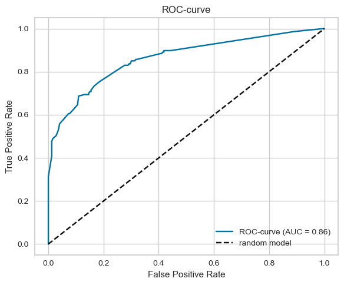
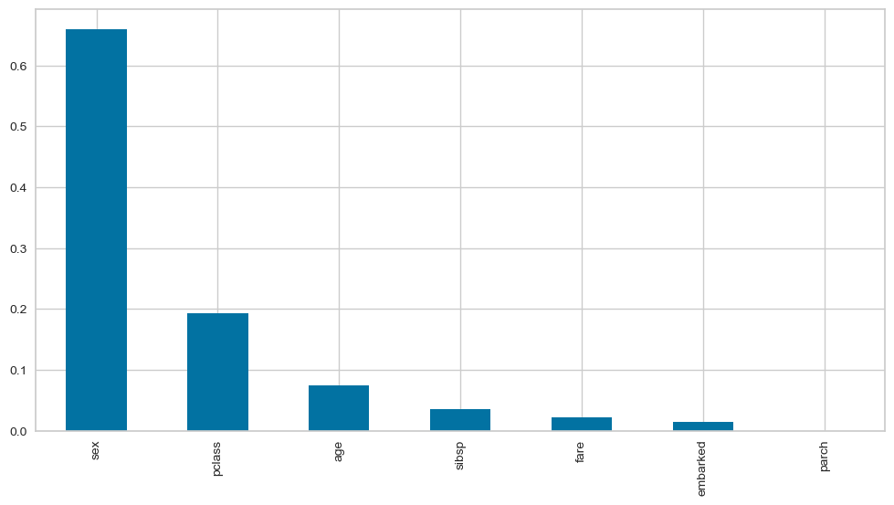

# Titanic Survival Prediction 🚢

Titanic survival prediction | Classification | Gradient Boosting | ROC-AUC 85.9%


Binary classification task predicting passenger survival on the Titanic.

## 📌 Overview
Exploratory Data Analysis, Feature Engineering, and comparison 
of multiple ML models to predict survival probability.

## 🛠 Tools & Libraries
Python, pandas, numpy, scikit-learn, feature-engine, 
matplotlib, seaborn, scipy

## 🤖 Models Used
- Logistic Regression
- Random Forest
- Decision Tree
- Support Vector Machine (SVM)
- K-Nearest Neighbors (KNN)
- Gradient Boosting Classifier

## 📊 Results

| Metric | Score |
|--------|-------|
| Accuracy | 80.2% |
| ROC-AUC | 85.9% |
| F1-Score | 68.5% |




**Best model: Gradient Boosting Classifier**

## 📁 Structure
```
├── Titanic_project.ipynb   # Main notebook
├── titanic.csv             # Dataset
└── experiments/            # Model experiments
```
